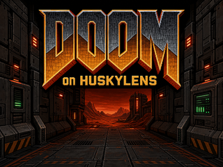

<div align="center">

<h1>DOOM on HuskyLens</h1>



<p><strong>Turn a HuskyLens into a tiny standalone DOOM console.</strong><br>
No soldering. No hardware mods. Add a microSD card, flash the firmware, and play.</p>

<p>
  <a href="https://aztechell.github.io/doom_on_huskylens/"><strong>Open the web flasher</strong></a>
  ·
  <a href="https://github.com/aztechell/doom_on_huskylens/releases/latest">Download the latest release</a>
</p>

</div>

DOOM on HuskyLens is made for fun first: a clean game picker, instant boot,
simple four-button controls, and the full classic game running directly on the
device. It is completely standalone after installation and does not need a PC
to play.

> [!NOTE]
> This port is intentionally soundless. Flashing replaces the firmware
> currently installed on your HuskyLens.

## What you need

- a [DFRobot Gravity: HuskyLens K210 AI Camera (SKU `SEN0305`)](https://www.dfrobot.com/product-1922.html) — the original K210 model, not HuskyLens 2;
- a FAT32-formatted microSD card;
- a USB cable and a desktop version of Chrome or Edge;
- a legally obtained `DOOM.WAD`, or the free Freedoom IWADs.

The original commercial DOOM data is not included.

## Install in three steps

### 1. Prepare the microSD card

Create a folder named `DOOM` in the root of the card and copy at least one of
these files into it:

```text
/DOOM/DOOM.WAD
/DOOM/FREEDOOM1.WAD
/DOOM/FREEDOOM2.WAD
```

Names are case-insensitive. You can install all three and choose one whenever
the device starts.

Don't own DOOM? [Download Freedoom 0.13.0 (Phase 1 + Phase 2)](https://github.com/freedoom/freedoom/releases/download/v0.13.0/freedoom-0.13.0.zip),
extract `freedoom1.wad` and/or `freedoom2.wad`, and copy them into `/DOOM/`.
See the [official Freedoom download page](https://freedoom.github.io/download.html)
for details and other packages.

### 2. Flash from the browser

Open the [DOOM on HuskyLens web flasher](https://aztechell.github.io/doom_on_huskylens/)
in desktop Chrome or Edge. It loads the available firmware versions directly
from this project's GitHub Releases — you do not need to download or select a
`.bin` file yourself.

1. Connect the HuskyLens over USB.
2. Choose a firmware release and wait for its SHA-256 check to complete.
3. Select the serial port and confirm that the current firmware may be replaced.
4. Start flashing and keep USB power connected until the device restarts.

The flasher runs locally in your browser. The selected release is verified
before Web Serial is allowed to write it. Desktop Chrome and Edge are the
supported browsers for this installer; other browsers are not part of the
tested release path.

Prefer PowerShell or need diagnostics? Use the
[command-line flashing guide](docs/FLASHING.md).

### 3. Insert the card and play

Insert the prepared microSD card and restart the HuskyLens. Choose a game with
`LEFT` or `RIGHT`, then press `OK`.

> [!TIP]
> The game-selection screen turns itself off after one minute without input.
> Press any button to wake it; your current selection is preserved.

## Controls

### Game

| Action | Controls |
| --- | --- |
| Turn | `LEFT` / `RIGHT` |
| Move forward | Hold `OK` |
| Move backward | Quickly tap `OK`, then press it again and hold |
| Fire | `BACK` |
| Open a door / use a switch | Hold `OK`, tap `BACK` once |
| Jump | Hold `OK`, double-tap `BACK` |
| Next owned weapon | Hold `BACK + RIGHT` |
| Open or close the DOOM menu | Hold `BACK + OK` |

### Menus

| Action | Controls |
| --- | --- |
| Previous / up | `LEFT` |
| Next / down | `RIGHT` |
| Select | `OK` |
| Open / close or go back | Hold `BACK + OK` |

## Quick troubleshooting

- **No game is found:** check that the card is FAT32 and the file is inside
  `/DOOM/` with one of the supported names above.
- **The game picker is black:** it has gone to sleep; press any button.
- **The web flasher cannot select a port:** use desktop Chrome or Edge, then
  reconnect the USB cable and close other serial applications.
- **No firmware release appears:** open the project's
  [Releases page](https://github.com/aztechell/doom_on_huskylens/releases)
  and retry after the Pages catalog updates.
- **Flashing cannot enter boot mode:** close other serial tools and retry with
  the HuskyLens connected directly to the PC.

## For developers

The main page deliberately keeps engineering details out of the way:

- [building and testing](docs/DEVELOPMENT.md);
- [advanced flashing and UART monitoring](docs/FLASHING.md);
- [license and source provenance audit](docs/GPL_AUDIT.md);
- [verified release results](docs/VERIFICATION.md).

## License and names

The combined firmware is released under GNU GPL version 3. Third-party
components retain their notices; see [THIRD_PARTY_NOTICES.md](THIRD_PARTY_NOTICES.md).
WAD files are separate game data and are not distributed here.

DOOM is a trademark of id Software/ZeniMax. HuskyLens is a DFRobot product.
This independent compatibility project is not affiliated with or endorsed by
id Software, ZeniMax, or DFRobot.
